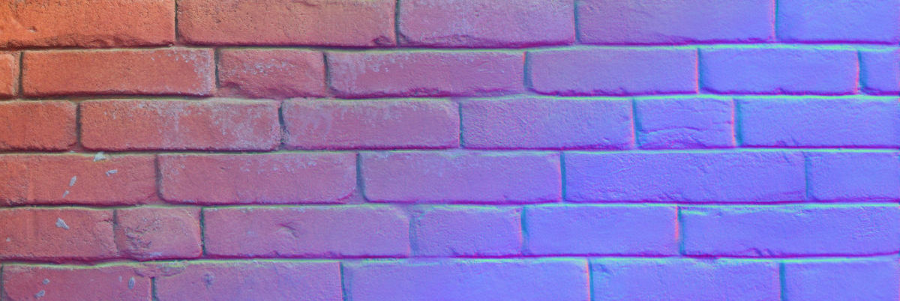

# DeepBump

DeepBump is a machine-learning driven tool to generate normal & height maps from single pictures. See this [blog post](https://hugotini.github.io/deepbump) for an introduction.

# Installation

1) [Download DeepBump as a ZIP](https://github.com/HugoTini/DeepBump/releases).

2) In Blender, go to _Edit -> Preferences -> Add-ons -> Install_ and select the downloaded ZIP file. Then enable the add-on.

3) In the add-on preference, click the '_Install dependencies_' button (this requires an internet connection and might take a while). In case of error, try running Blender as administrator for this step.

By installing those dependencies, be aware of [Microsoft conditions](https://github.com/microsoft/onnxruntime/blob/master/docs/Privacy.md). This add-on use available APIs to disable telemetry.

# Usage

Check the [blog post](https://hugotini.github.io/deepbump) first video.

In the Shader Editor, in the right panel under the _DeepBump_ tab:

**Color (albedo) → Normals** : Select a color image node and click _Generate Normal Map_.

**Normals → Height (displacement)** : Select the generated normal map image node and click _Generate Height Map_.

**Normals → Curvature** : Select the generated normal map image node and click _Generate Curvature Map_.

For command-line usage, see [cli.md](cli.md).

# License

This repo is under the [GPL license](LICENSE). The training code is currently not available.
